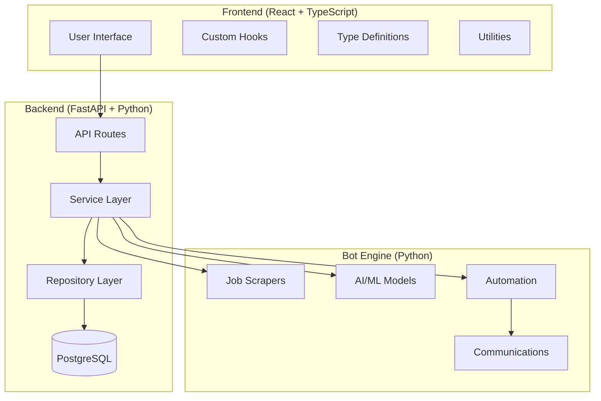
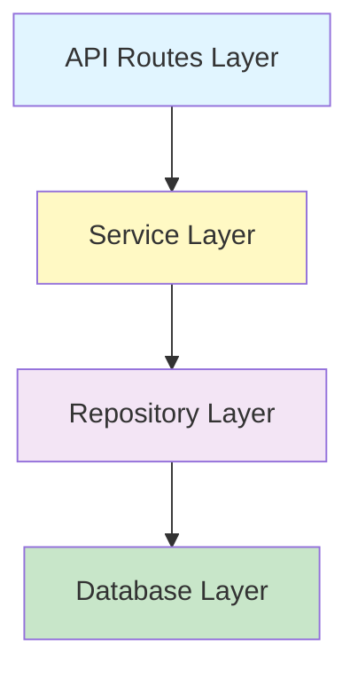
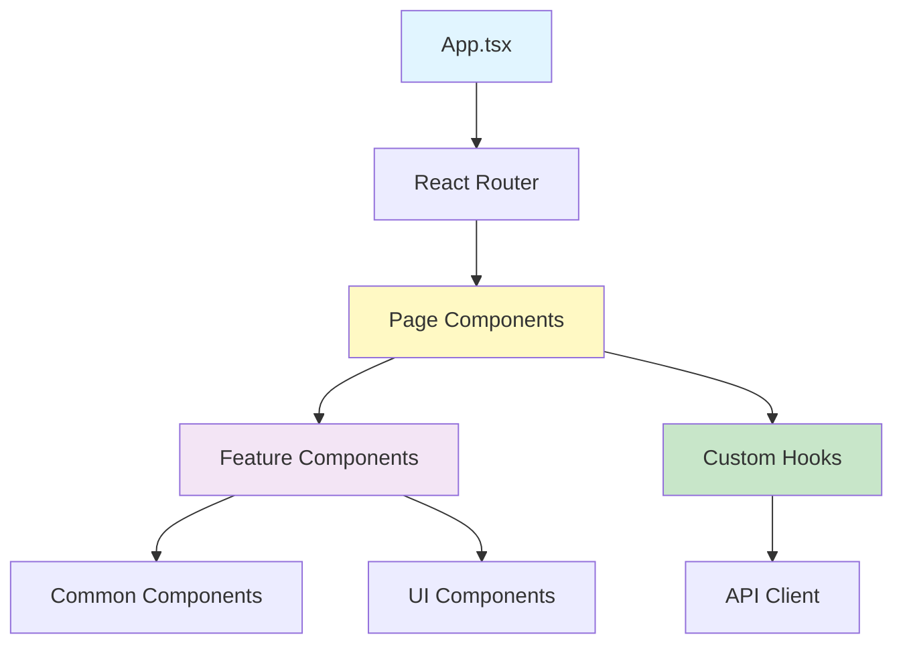
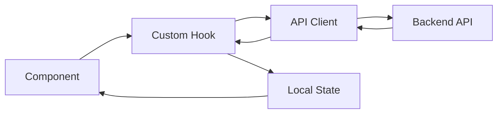
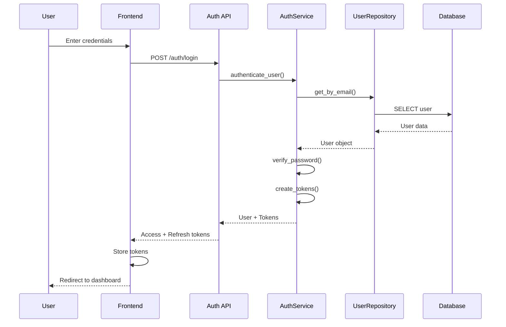
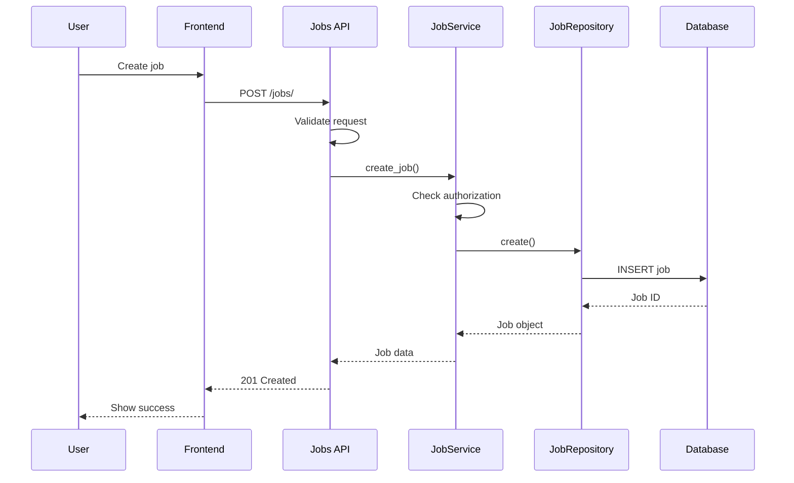
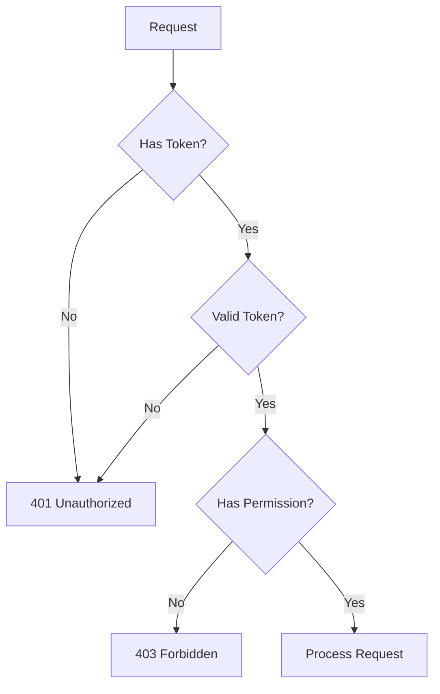
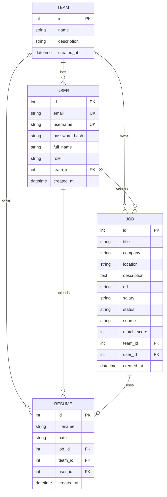
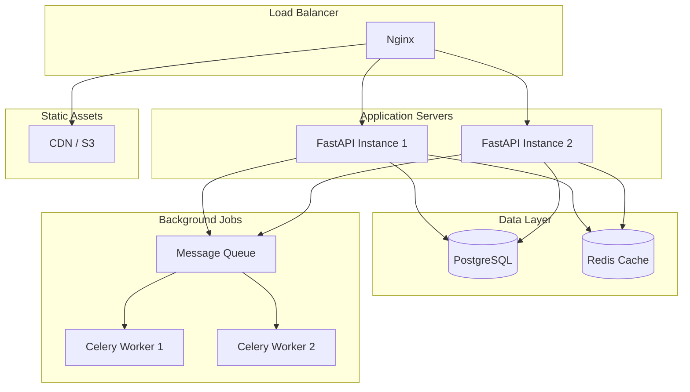

# Architecture Documentation

## System Overview

The AI Job Automation SaaS platform is a full-stack application designed to automate job search and application processes using AI.

---

## High-Level Architecture



---

## Backend Architecture

### Layered Architecture Pattern



### Component Breakdown

#### 1. API Routes Layer
**Responsibility:** HTTP request handling, validation, response formatting

**Components:**
- `auth.py` - Authentication endpoints
- `jobs.py` - Job management endpoints
- `resumes.py` - Resume operations endpoints
- `stats.py` - Statistics endpoints

**Key Features:**
- Request validation (Pydantic)
- Response serialization
- HTTP status codes
- Dependency injection

#### 2. Service Layer
**Responsibility:** Business logic, authorization, orchestration

**Components:**
- `AuthService` - User authentication, token management
- `JobService` - Job CRUD, search, statistics
- `ResumeService` - Resume operations
- `TeamService` - Team management

**Key Features:**
- Business rule enforcement
- Authorization checks
- Transaction management
- Error handling

#### 3. Repository Layer
**Responsibility:** Data access, database queries

**Components:**
- `BaseRepository<T>` - Generic CRUD operations
- `UserRepository` - User data access
- `JobRepository` - Job data access
- `ResumeRepository` - Resume data access
- `TeamRepository` - Team data access

**Key Features:**
- Type-safe queries
- Async operations
- Query optimization
- Error handling

#### 4. Database Layer
**Technology:** PostgreSQL with SQLAlchemy (async)

**Models:**
- `User` - User accounts
- `Team` - Team/organization
- `Job` - Job postings
- `Resume` - Resume files
- `Log` - System logs

---

## Frontend Architecture

### Component Hierarchy



### Directory Structure

```
frontend/src/
├── components/          # Reusable components
│   ├── common/         # Common UI elements
│   ├── features/       # Feature-specific components
│   ├── layout/         # Layout components
│   └── ui/             # Base UI components
├── hooks/              # Custom React hooks
│   ├── useAuth.ts
│   ├── useJobs.ts
│   ├── useResumes.ts
│   └── ...
├── types/              # TypeScript type definitions
│   ├── api.ts
│   ├── models.ts
│   ├── components.ts
│   └── hooks.ts
├── utils/              # Utility functions
│   ├── logger.ts
│   └── api.ts
├── pages/              # Page components
│   ├── Dashboard/
│   ├── Jobs/
│   ├── Resumes/
│   └── ...
└── context/            # React context providers
```

### State Management



**Strategy:**
- Custom hooks for data fetching
- React Context for global state
- Local state for UI state
- No external state management library (Redux, etc.)

---

## Data Flow

### Authentication Flow



### Job Creation Flow



---

## Security Architecture

### Authentication & Authorization



**Security Layers:**
1. **JWT Authentication** - Bearer token validation
2. **Password Hashing** - bcrypt with salt
3. **Token Refresh** - Refresh token rotation
4. **Rate Limiting** - 100 req/min per user
5. **Input Validation** - Pydantic schemas
6. **SQL Injection Prevention** - SQLAlchemy ORM
7. **CORS** - Configured allowed origins

---

## Database Schema

### Entity Relationship Diagram



---

## Deployment Architecture

### Production Setup



---

## Technology Stack

### Backend
- **Framework:** FastAPI 0.104+
- **Language:** Python 3.11+
- **Database:** PostgreSQL 15+
- **ORM:** SQLAlchemy 2.0+ (async)
- **Authentication:** python-jose (JWT)
- **Validation:** Pydantic 2.0+
- **Cache:** Redis
- **Task Queue:** Celery
- **Web Server:** Uvicorn

### Frontend
- **Framework:** React 18+
- **Language:** TypeScript 5.0+
- **Build Tool:** Vite 5.0+
- **Routing:** React Router 6+
- **Styling:** TailwindCSS 3+
- **Charts:** Recharts
- **Icons:** Lucide React
- **HTTP Client:** Fetch API

### Bot Engine
- **Scraping:** Selenium, BeautifulSoup
- **AI/ML:** OpenAI GPT, scikit-learn
- **Resume:** LaTeX, PyPDF2
- **Email:** SMTP, Jinja2 templates

### DevOps
- **Containerization:** Docker
- **Orchestration:** Docker Compose
- **CI/CD:** GitHub Actions
- **Monitoring:** Prometheus, Grafana
- **Logging:** ELK Stack

---

## Performance Considerations

### Backend Optimizations
1. **Async Operations** - All I/O operations are async
2. **Connection Pooling** - Database connection pool
3. **Query Optimization** - Indexed columns, efficient queries
4. **Caching** - Redis for frequently accessed data
5. **Pagination** - Limit result sets
6. **Lazy Loading** - Load related data on demand

### Frontend Optimizations
1. **Code Splitting** - Lazy load routes
2. **Tree Shaking** - Remove unused code
3. **Memoization** - React.memo, useMemo, useCallback
4. **Virtual Scrolling** - For large lists
5. **Image Optimization** - Lazy loading, WebP format
6. **Bundle Size** - Minimize dependencies

---

## Scalability

### Horizontal Scaling
- **Stateless API** - Can run multiple instances
- **Load Balancing** - Distribute traffic
- **Database Replication** - Read replicas
- **Caching Layer** - Reduce database load
- **CDN** - Static asset delivery

### Vertical Scaling
- **Database Optimization** - Indexes, partitioning
- **Connection Pooling** - Efficient resource usage
- **Query Optimization** - Reduce query complexity
- **Caching** - In-memory data storage

---

## Monitoring & Logging

### Logging Strategy
```
Application Logs → Structured JSON → File Rotation → ELK Stack
```

**Log Levels:**
- DEBUG - Development debugging
- INFO - General information
- WARNING - Warning messages
- ERROR - Error conditions
- CRITICAL - Critical failures

### Metrics
- Request rate
- Response time
- Error rate
- Database query time
- Cache hit rate
- Active users

---

## Future Enhancements

1. **Microservices** - Split into smaller services
2. **GraphQL** - Alternative API layer
3. **WebSockets** - Real-time updates
4. **Message Queue** - Async job processing
5. **Multi-tenancy** - Better team isolation
6. **API Versioning** - Support multiple API versions
