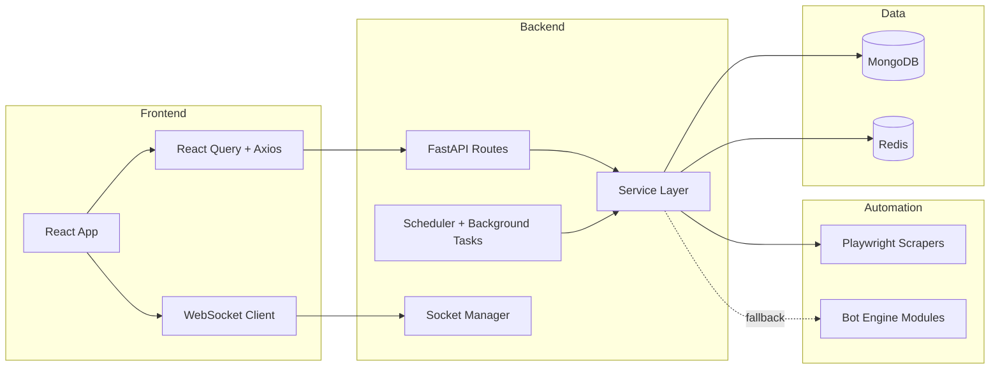

# AI Job Automation Platform

A production-style full-stack SaaS platform for job discovery, resume intelligence, and automation workflows.

[](./LICENSE)


## Table of Contents

- [Product Snapshot](#product-snapshot)
- [Live URLs](#live-urls)
- [Highlights](#highlights)
- [Architecture Overview](#architecture-overview)
- [Monorepo Layout](#monorepo-layout)
- [Core Stack](#core-stack)
- [Features](#features-current-scope)
- [Local Setup](#local-setup)
- [Documentation Hub](#documentation-hub)
- [Roadmap](#roadmap)
- [Environment Configuration](#environment-configuration)
- [Testing](#testing)
- [Deployment & Ops](#deployment--ops)
- [Runtime Notes](#runtime-notes)
- [Security and Operations](#security-and-operations)
- [Contributing](#contributing)
- [License](#license)

## Product Snapshot

AI Job Automation Platform combines a modern job-search workspace with asynchronous automation pipelines.
It helps users discover jobs, optimize resumes, and orchestrate application-related actions through an API-first architecture.

### What Makes It Different

- Purpose-built for async operations: websockets, background tasks, retries, and dead-letter monitoring.
- Bridges product UX and automation internals in one monorepo.
- Uses service-oriented boundaries that are clear enough for both humans and AI agents to extend safely.

### Capability Map

| Domain              | What Users Get                                      | How It Is Implemented                                                 |
| ------------------- | --------------------------------------------------- | --------------------------------------------------------------------- |
| Resume Intelligence | Resume upload, parsing, and generation workflows    | AI-backed services, PDF/text extraction, compile/processing endpoints |
| Job Discovery       | Search, scrape, and pipeline management             | Scraper services, queue-like background execution, status persistence |
| Automation Control  | Multi-step orchestration and operational visibility | Agents, scheduler jobs, dead-letter replay, admin telemetry           |
| Live Feedback       | Real-time progress and activity streams             | Authenticated websocket channel and frontend subscriptions            |

## Live URLs

- Frontend: https://ai-job-automation-platform-ebon.vercel.app
- Backend: https://ai-job-automation-platform.onrender.com
- Backend health: https://ai-job-automation-platform.onrender.com/health
- Backend docs (when `DEBUG=true`): https://ai-job-automation-platform.onrender.com/docs

## Highlights

- Combines traditional CRUD SaaS patterns with asynchronous automation pipelines.
- Uses AI-assisted resume and matching flows while keeping deterministic service boundaries.
- Includes operational concepts (dead letters, retries, scheduler jobs, websocket telemetry).
- Organized as a monorepo with frontend, backend, and automation runtime domains.

## Architecture Overview



## Monorepo Layout

<table>
	<thead>
		<tr>
			<th align="left">Folder</th>
			<th align="left">Purpose</th>
			<th align="left">Highlights</th>
		</tr>
	</thead>
	<tbody>
		<tr>
			<td><code>backend/</code></td>
			<td>API and business logic</td>
			<td>FastAPI, Beanie/MongoDB, Redis, APScheduler, service layer</td>
		</tr>
		<tr>
			<td><code>frontend/</code></td>
			<td>Product UI</td>
			<td>React 18, TypeScript, Vite, TanStack Query, Tailwind</td>
		</tr>
		<tr>
			<td><code>bot_engine/</code></td>
			<td>Automation runtime</td>
			<td>Selenium helpers, scrapers, queue workers, email tooling</td>
		</tr>
		<tr>
			<td><code>scripts/</code></td>
			<td>Repo utilities</td>
			<td>Test, review, and maintenance scripts</td>
		</tr>
		<tr>
			<td><code>project_context/</code></td>
			<td>Documentation hub</td>
			<td>Architecture, workflow, deployment, and subsystem internals</td>
		</tr>
	</tbody>
</table>

## Core Stack

### Backend

- FastAPI
- Beanie + Motor (MongoDB)
- Redis
- APScheduler
- Pydantic v2

### Frontend

- React 18
- TypeScript
- Vite
- TanStack Query
- Tailwind CSS
- Vitest + Testing Library

## Features (Current Scope)

- Authentication and user profile management
- Resume upload and resume generation workflows
- Job scraping and pipeline tracking
- Email and automation endpoints/services
- WebSocket-based activity updates
- Admin and dead-letter monitoring flows

## Local Setup

## Prerequisites

- Python 3.11+
- Node.js 18+
- MongoDB
- Redis

## 1) Backend

```bash
cd backend
python -m venv .venv
# Windows PowerShell
.\.venv\Scripts\Activate.ps1
pip install -r requirements.txt
copy .env.example .env
python -m uvicorn app.main:app --reload
```

Backend runs at `http://127.0.0.1:8000`.

## 2) Frontend

```bash
cd frontend
npm install
copy .env.example .env
npm run dev
```

Frontend runs at `http://localhost:5173`.

## Documentation Hub

The `project_context/` folder is the repository playbook for contributors and AI agents.

### Recommended Reading Order

1. `project_context/01-system-overview.md`
2. `project_context/02-architecture_overview.md`
3. `project_context/10-workflows.md`

### Full Index (Expandable)

<details>
<summary>Open full project_context index</summary>

<br />

| Doc                                             | Primary Use                                            |
| ----------------------------------------------- | ------------------------------------------------------ |
| `project_context/01-system-overview.md`         | Cross-system boundaries and subsystem selection        |
| `project_context/02-architecture_overview.md`   | Runtime domains, stack map, and system split           |
| `project_context/03-backend-internals.md`       | Backend service patterns and guardrails                |
| `project_context/04-database_schema.md`         | Model relationships and collection schemas             |
| `project_context/05-automation-engine.md`       | Scraper architecture, anti-bot strategy, retry/replay  |
| `project_context/06-frontend_architecture.md`   | Provider tree, routes, and frontend architecture       |
| `project_context/07-backend_api_routes.md`      | Endpoint surface and router map                        |
| `project_context/08-frontend-internals.md`      | Hooks, contexts, service integrations, state ownership |
| `project_context/09-bot_engine_and_scrapers.md` | Bot engine module-level implementation details         |
| `project_context/10-workflows.md`               | End-to-end async flows and failure isolation           |
| `project_context/11-devops_and_deployment.md`   | Deploy topology and runtime operations                 |

</details>

### Task-Based Paths

- New API feature: `01 -> 03 -> 04 -> 07`
- Scraping/automation debugging: `01 -> 05 -> 09 -> 10`
- Frontend feature implementation: `01 -> 06 -> 08 -> 10`
- Deployment/runtime investigation: `01 -> 11`

## Roadmap

This roadmap tracks major product and engineering themes, not strict release dates.

- [ ] Expand provider integrations for job ingestion beyond current scraping paths
- [ ] Add richer ATS/resume evaluation reports with explainability views in UI
- [ ] Improve automation observability with deeper per-step tracing and replay controls
- [ ] Harden production readiness with stronger health diagnostics and failure simulation tests
- [ ] Add richer contributor/dev onboarding automation (one-command local bootstrap)

## Environment Configuration

Use these templates as starting points:

- `backend/.env.example`
- `frontend/.env.example`
- `.env.production.template`

## Testing

Run full repository tests with coverage:

```powershell
.\scripts\test-all.ps1
```

Backend and frontend also include local scripts in their own `scripts/` folders.

## Deployment & Ops

- Frontend: Vercel (`frontend/vercel.json`)
- Backend: Render (`render.yaml`)
- Deployment guide: `DEPLOYMENT.md`

## Runtime Notes

- API base path: `/api/v1`
- Health endpoint: `/health`
- WebSocket endpoint: `/ws`
- Production API docs disabled when `DEBUG=false`

## Security and Operations

- Configure strong production values for `SECRET_KEY` and `CSRF_SECRET_KEY`
- Restrict `BACKEND_CORS_ORIGINS` and `ALLOWED_HOSTS` to trusted domains
- Configure MongoDB/Redis/SMTP/AI credentials via environment variables

## Contributing

1. Create a feature branch.
2. Make focused, scoped changes.
3. Run tests/lint.
4. Open a pull request.

### Contribution Labels

Use a consistent label format on issues and pull requests to improve triage:

| Label              | Purpose                                            |
| ------------------ | -------------------------------------------------- |
| `area:frontend`    | UI, routing, React hooks, component behavior       |
| `area:backend`     | FastAPI endpoints, services, auth, data flow       |
| `area:automation`  | Scrapers, bot engine, orchestrator/agent workflows |
| `area:docs`        | README, project_context docs, architecture notes   |
| `type:bug`         | Regressions, incorrect behavior, runtime failures  |
| `type:feature`     | New user-facing or platform capability             |
| `type:refactor`    | Internal improvements without behavior changes     |
| `type:test`        | Test coverage additions or test framework changes  |
| `priority:high`    | Urgent fix or high-impact user issue               |
| `good-first-issue` | Beginner-friendly tasks with clear scope           |

## License

This project is licensed under the MIT License. See [LICENSE](./LICENSE) for details.
For full license text and terms, see https://opensource.org/licenses/MIT.
