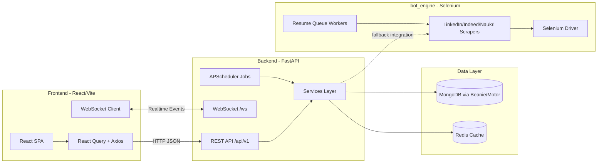

# 01 System Overview

## How to Use This Document

Always read this file first to understand the boundaries of the three systems. Do not suggest frontend libraries in the backend, and respect the separation of concerns between the FastAPI backend and the Selenium bot engine.

Guidance for future AI instances:

- Treat this as the source of truth for cross-system boundaries before proposing changes.
- Keep frontend concerns in frontend and Python API concerns in backend.
- Keep browser automation and scraping execution concerns in bot_engine unless backend explicitly imports a bot_engine helper.
- Validate dependencies against the actual manifest files before recommending libraries or upgrades.

## Related Context Docs

Read these next, depending on task scope:

- `project_context/02-architecture_overview.md` for repo-wide service boundaries and stack orientation.
- `project_context/03-backend-internals.md` for endpoint patterns, model relationships, and service contracts.
- `project_context/04-database_schema.md` for collection-level details and model mapping.
- `project_context/05-automation-engine.md` for scraper architecture, orchestration agents, and replay/retry behavior.
- `project_context/06-frontend_architecture.md` for route/context/hook/UI architecture.
- `project_context/07-backend_api_routes.md` for route-level input/output details.
- `project_context/08-frontend-internals.md` for frontend service/context/hook internals.
- `project_context/09-bot_engine_and_scrapers.md` for automation and scraper internals.
- `project_context/10-workflows.md` for end-to-end async communication flows and failure isolation across layers.
- `project_context/11-devops_and_deployment.md` for deployment and pipeline behavior.

## Scope and Inputs Used

This overview is based on these files:

- Root directory inventory
- Root package manifest: package.json
- Frontend package manifest: frontend/package.json
- Backend Python dependencies: backend/requirements.txt
- Bot engine Python dependencies: bot_engine/requirements.txt

## Monorepo Top-Level Systems

- frontend: React + TypeScript SPA built with Vite.
- backend: FastAPI service with Beanie/MongoDB, Redis, scheduler, AI/email/scraping service orchestration.
- bot_engine: Selenium-oriented automation and scraping helpers with its own Python dependency set.

## Exact Frontend Frameworks and Libraries

From frontend/package.json.

Core framework/runtime:

- react 18.2.0
- react-dom 18.2.0
- typescript 5.3.3
- vite 5.4.21
- @vitejs/plugin-react 4.2.1

Routing and data/state:

- react-router-dom 6.21.3
- @tanstack/react-query ^5.90.21
- @tanstack/react-query-devtools ^5.91.3
- @tanstack/react-virtual 3.0.1
- axios 1.6.2

UI, animation, validation, charts:

- tailwindcss 3.4.1
- tailwind-merge 2.2.1
- clsx 2.1.0
- framer-motion ^11.0.3
- @react-spring/web ^10.0.3
- react-hook-form ^7.71.1
- @hookform/resolvers ^5.2.2
- zod ^4.3.6
- lucide-react 0.316.0
- chart.js 4.4.1
- react-chartjs-2 5.2.0
- recharts 2.11.0
- react-dropzone 14.2.3
- react-helmet-async 2.0.4
- socket.io-client 4.7.4
- cmdk ^1.1.1
- date-fns ^3.3.1

Testing/linting/build tooling:

- vitest 1.6.1
- @vitest/coverage-v8 ^1.6.1
- @vitest/ui 1.6.1
- @testing-library/react 14.2.1
- @testing-library/jest-dom 6.4.1
- @testing-library/user-event ^14.5.2
- eslint 8.56.0
- @typescript-eslint/eslint-plugin 6.21.0
- @typescript-eslint/parser 6.21.0
- prettier 3.2.4
- postcss 8.4.34
- autoprefixer 10.4.17

## Exact Backend Frameworks and Libraries

From backend/requirements.txt.

API and server:

- fastapi>=0.109.0
- uvicorn[standard]>=0.27.0

Data and models:

- motor>=3.3.0
- beanie>=1.25.0
- pydantic>=2.6.0
- pydantic-settings>=2.1.0
- redis>=5.0.1

Auth, validation, transport:

- python-jose[cryptography]>=3.3.0
- passlib[bcrypt]>=1.7.4
- python-multipart>=0.0.9
- email-validator>=2.1.0.post1
- httpx>=0.26.0
- requests>=2.31.0

Automation/scraping and parsing:

- playwright>=1.41.1
- beautifulsoup4>=4.12.3
- lxml>=5.1.0
- pypdf>=4.0.0
- python-docx>=1.1.0

AI, templating, messaging, reliability:

- openai>=1.10.0
- jinja2>=3.1.3
- aiosmtplib>=3.0.0
- APScheduler>=3.10.4
- pytz>=2024.1
- tenacity>=8.2.3
- aiofiles>=23.2.1
- python-dotenv>=1.0.1

Testing:

- pytest>=8.0.0
- pytest-asyncio==0.21.1

## Exact bot_engine Frameworks and Libraries

From bot_engine/requirements.txt.

Automation/scraping core:

- selenium
- webdriver-manager
- beautifulsoup4
- fake-useragent
- requests
- schedule

AI/data/ML utilities:

- openai
- scikit-learn
- pandas

Messaging and templating:

- python-telegram-bot
- jinja2

Data access:

- sqlalchemy
- psycopg2-binary

## Root Monorepo Tooling (package.json)

From root package.json:

- Node engine: >=20 <23
- Scripts proxy to frontend workspace:
  - build: npm --prefix frontend run build
  - dev: npm --prefix frontend run dev
  - lint: npm --prefix frontend run lint
  - test: npm --prefix frontend run test

## High-Level Architecture Diagram

## Separation of Concerns and Boundaries

- Frontend boundary:
  - Responsible for UI rendering, route handling, client-side state and API calls.
  - Must not contain backend-only runtime concerns such as Playwright, APScheduler, or database ODM code.

- Backend boundary:
  - Responsible for API contracts, authentication, persistence, scheduling, orchestration, and websocket publishing.
  - Must not adopt frontend-only libraries (React ecosystem packages) in backend service code.

- bot_engine boundary:
  - Responsible for Selenium-style automation helpers and parallel scraper worker patterns.
  - Treated as automation module space; backend may call it explicitly where integration exists, but it remains separate from FastAPI request lifecycle logic.

## Practical Rule for Future AI Changes

Before proposing any dependency or architecture change:

1. Identify which of the three systems the change belongs to.
2. Verify the library exists in that system's manifest.
3. Keep interfaces between systems explicit (HTTP, websocket, or deliberate Python module integration).
4. Avoid cross-pollinating frontend and backend dependency ecosystems.
