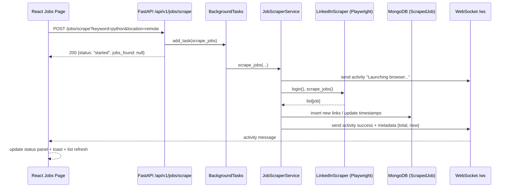

# 02 Architecture Overview

## Monorepo Service Split

This repository contains three primary runtime domains:

1. Frontend SPA in `frontend/` (React + Vite + TypeScript).
2. API and automation backend in `backend/` (FastAPI + Beanie/MongoDB + APScheduler).
3. Bot and scraping engine modules in `bot_engine/` (Selenium-based automation helpers and queue workers).

Supporting root-level orchestration includes deployment configs (`render.yaml`, `vercel.json`) and test/review scripts in `scripts/`.

## Technology Stack by Service

### Frontend (`frontend/`)

- Framework: React 18 (`react`, `react-dom`).
- Routing: `react-router-dom`.
- Data fetching/cache: `@tanstack/react-query`.
- HTTP client: `axios` via `frontend/src/lib/api.ts`.
- Styling: Tailwind CSS.
- Animations: `framer-motion`, `@react-spring/web`.
- Charting: `chart.js`, `react-chartjs-2`, `recharts`.
- Forms/validation: `react-hook-form`, `zod`.
- WebSocket client: native browser `WebSocket` in `frontend/src/hooks/useWebSocket.ts`.

### Backend (`backend/`)

- API framework: FastAPI (`backend/app/main.py`).
- Data layer: Beanie ODM + Motor async Mongo client (`backend/app/db/mongo.py`).
- Auth/JWT: `python-jose`, password hashing via `passlib`.
- Scheduling: APScheduler (`backend/app/scheduler/scheduler.py`).
- Scraping runtime: Playwright (`backend/app/automation/browser.py`).
- Email: Resend/SMTP-compatible logic in email services.
- Cache: Redis-configured cache abstraction (`REDIS_URL` in config).

### Bot Engine (`bot_engine/`)

- Browser automation: Selenium + webdriver-manager (`bot_engine/automation/selenium_driver.py`).
- Scrapers: LinkedIn/Indeed/Naukri scraper modules (`bot_engine/scrapers/`).
- Parallel scraping utility: `bot_engine/scrapers/parallel_scraper.py` (ThreadPoolExecutor + rate limiting).
- Resume generation queue: `bot_engine/queue/resume_queue.py` (thread workers + in-memory queue/results).

## Backend Process Architecture

### FastAPI application lifecycle

Defined in `backend/app/main.py`:

- Lifespan startup:
  - `init_db()` initializes Beanie document models.
  - `start_scheduler()` starts APScheduler jobs.
- Lifespan shutdown:
  - `shutdown_scheduler()`.
- Middleware stack includes:
  - custom logging/metrics middleware,
  - CORS,
  - rate limiting,
  - optional CSRF middleware,
  - security headers injection.

### Router composition

`backend/app/api/api.py` mounts endpoint modules under `settings.API_V1_STR` (`/api/v1`), including:

- auth, jobs, resumes, ai, logs, stats, scheduler, agent, admin,
- email/email-automation/emails,
- bot control,
- features,
- websocket endpoint router.

## Inter-service Communication Patterns

### 1. Frontend -> Backend (REST)

- Base URL in frontend client: `frontend/src/lib/api.ts`.
  - Production default: `https://ai-job-automation-platform.onrender.com/api/v1`.
  - Dev default: `http://localhost:8000/api/v1`.
- Auth tokens are attached via Axios request interceptors.
- Automatic token refresh on 401 via `/auth/refresh`.

### 2. Frontend <-> Backend (WebSocket)

- Backend route: `/ws` in `backend/app/api/endpoints/websockets.py`.
- Frontend hook: `frontend/src/hooks/useWebSocket.ts`.
- Authentication: JWT token passed as `?token=` query param.
- Pattern: shared singleton socket in frontend with subscriber fan-out.
- Message usage examples:
  - activity updates from `JobScraperService.send_progress()`,
  - bot status/log stream from `backend/app/api/endpoints/bot_runner.py`,
  - notification payloads consumed in NotificationContext.

### 3. Backend internal async orchestration

- FastAPI `BackgroundTasks` used for long-running operations:
  - job scraping (`/jobs/scrape`),
  - multi-agent pipeline (`/agent/multi-apply`),
  - email scans and replay operations.
- APScheduler executes periodic jobs:
  - scrape jobs every 6h,
  - job automation every 1h,
  - follow-up checks daily,
  - log cleanup daily.

### 4. Bot engine coupling

- Direct backend usage of bot engine exists in fallback path:
  - `backend/app/services/job_scraper.py` imports `bot_engine.scrapers.linkedin.scrape_jobs_from_linkedin` on Windows NotImplementedError fallback.
- `bot_engine` can also run standalone (see `bot_engine/engine.py`, `bot_engine/main.py`), but primary production API flow is in backend service modules.

## Data and State Boundaries

### Persistent state

- MongoDB collections via Beanie models (Users, Jobs, Resumes, Logs, Matches, Automation\*).
- Redis-backed cache for list endpoints and scraped-job caching behavior.

### Ephemeral/runtime state

- In-memory socket connection maps (`SocketManager.user_connections`).
- In-memory running bot flags (`_running_bots` in `bot_runner.py`).
- In-memory queue/result dictionaries in `bot_engine/queue/resume_queue.py`.

## Automation and Decision Flow (Current Implementation)

High-level auto-apply orchestration path:

1. API trigger (`/agent/multi-apply`).
2. `OrchestratorAgent.run_pipeline()` in `backend/agents/orchestrator_agent.py`.
3. Job scrape via `JobScraperService.scrape_jobs()`.
4. Decisioning via `DecisionAgent.decide()`.
5. ATS gate via AI scoring (`ai_service.score_latex_resume`).
6. Resume generation + email dispatch abstractions.
7. Event/dead-letter persistence (`AutomationEvent`, `AutomationDeadLetter`).

Bot service auto-apply path (`backend/app/services/bot.py`) similarly logs automation events and writes dead letters on failures.

## Reliability Patterns Present in Code

- Runtime Playwright install retry when browser executable is missing (`BrowserManager._launch_with_retry`).
- Retry and timeout decorators used in bot service (`async_retry_with_backoff`, `timeout`).
- Scheduler execution locks via `with_execution_lock` to avoid concurrent duplicate runs.
- Feature-gate checks (`features.require(...)`) around AI/email/scraping/auto-apply capabilities.
- Frontend resilience:
  - auth and feature-flag fetch short timeouts with fallback behavior,
  - shared websocket singleton to prevent reconnect thrash.

## Sequence Diagram: Scrape Request to Live UI Update



## Runtime Message Envelope Example (WebSocket)

```json
{
  "type": "activity",
  "data": {
    "activityType": "success",
    "title": "Job Scraper",
    "description": "Scraping complete! Found 10 jobs (3 new).",
    "metadata": {
      "total": 10,
      "new": 3
    }
  },
  "timestamp": "2026-04-09T12:34:56.000Z"
}
```
