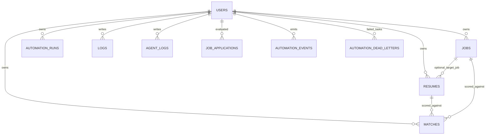

# 04 Database Schema

This schema is derived from Beanie `Document` models in `backend/app/models` and Beanie initialization in `backend/app/db/mongo.py`.

## Model Registration Order

`init_db()` registers these document models:

1. `User`
2. `Resume`
3. `Job`
4. `ScrapedJob`
5. `Match`
6. `AutomationRun`
7. `AgentLog`
8. `Log`
9. `JobApplication`
10. `AutomationEvent`
11. `AutomationDeadLetter`

## Core Collections Requested

## Users (`users`)

Model: `User` in `backend/app/models/user.py`.

Fields:

- `username: Indexed(str, unique=True)`
- `email: Indexed(EmailStr, unique=True)`
- `password_hash: str`
- `full_name: Optional[str] = None`
- `role: UserRole = UserRole.USER` (`admin` or `user`)
- `is_active: bool = True`
- `created_at: datetime = default_factory(datetime.utcnow)`
- `updated_at: Optional[datetime] = None`

Indexes/constraints:

- unique index on `username`
- unique index on `email`

## Jobs (`jobs`)

Model: `Job` in `backend/app/models/job.py`.

Fields:

- `title: str`
- `company: str`
- `location: Optional[str] = None`
- `description: str`
- `salary_range: Optional[str] = None`
- `job_url: Optional[str] = None`
- `hr_email: Optional[str] = None`
- `status: JobStatus = pending`
- `skills_required: List[str] = []`
- `user_id: PydanticObjectId`
- `applied_at: Optional[datetime] = None`
- `created_at: datetime`
- `updated_at: datetime`

Indexes:

- single-field indexes on `title`, `company`, `status`, `user_id`, `skills_required`
- compound index `[('user_id', 1), ('status', 1)]`
- compound index `[('user_id', 1), ('created_at', -1)]`

## Resumes (`resumes`)

Model: `Resume` in `backend/app/models/resume.py`.

Fields:

- `user_id: PydanticObjectId`
- `content: Optional[str] = None`
- `file_path: Optional[str] = None`
- `filename: Optional[str] = None`
- `template: str = 'professional'`
- `job_id: Optional[PydanticObjectId] = None`
- `parsed_data: Dict[str, Any] = {}`
- `embedding_vector: List[float] = []`
- `created_at: datetime`
- `updated_at: Optional[datetime] = None`

Indexes:

- `user_id`

## Logs (`logs`, `agent_logs`)

### Logs (`logs`)

Model: `Log` in `backend/app/models/log.py`.

Fields:

- `action: str`
- `details: Optional[str] = None`
- `level: str = 'info'`
- `user_id: Optional[PydanticObjectId] = None`
- `created_at: datetime`

Indexes:

- `created_at`, `level`, `action`, `user_id`

### Agent logs (`agent_logs`)

Model: `AgentLog` in `backend/app/models/log.py`.

Fields:

- `agent_name: str`
- `user_id: Optional[PydanticObjectId] = None`
- `input: Any = None`
- `output: Any = None`
- `execution_time_ms: float = 0.0`
- `status: str = 'success'`
- `created_at: datetime`

Indexes:

- `created_at`, `agent_name`, `user_id`

## Additional Collections (Important for Relationships)

## Scraped jobs (`scraped_jobs`)

Model: `ScrapedJob` in `backend/app/models/job.py`.

Fields:

- `title`, `company`, `location`, `link`, `description`, `posted_at`, `created_at`

Indexes:

- `link`, `title`, `company`

## Matches (`matches`)

Model: `Match` in `backend/app/models/match.py`.

Fields:

- `user_id`, `resume_id`, `job_id`, `match_score`, `reasoning`, `created_at`

Indexes:

- `user_id`, `job_id`, `resume_id`

## Automation runs (`automation_runs`)

Model: `AutomationRun` in `backend/app/models/automation.py`.

Fields:

- `user_id`, `resume_id`, `applied_jobs: List[str]`, `status`, `applied_count`, timestamps

Indexes:

- `user_id`, `status`

## Job applications (`job_applications`)

Model: `JobApplication` in `backend/app/models/job_application.py`.

Fields:

- `company`, `role`, `decision`, `score`, `status`, `reply_received`, `user_id`, `created_at`

Indexes:

- unique compound index on `(company, role, user_id)` named `unique_user_application`

## Automation events (`automation_events`)

Model: `AutomationEvent` in `backend/app/models/automation_event.py`.

Fields:

- `user_id`, `source`, `stage`, `company`, `role`, `action`, `reason`, `ats_score`, `passes_gate`, `override_used`, `metadata`, `created_at`

Indexes:

- `user_id`, `source`, `stage`, `action`, `created_at`

## Dead letters (`automation_dead_letters`)

Model: `AutomationDeadLetter` in `backend/app/models/automation_dead_letter.py`.

Fields:

- `user_id`, `source`, `stage`, `task_name`, `error_message`, `payload`, `metadata`, `retry_count`, `status`, `created_at`

Indexes:

- `source`, `stage`, `task_name`, `status`, `user_id`, `created_at`

## Relationship Map

## User-centric ownership

- `Job.user_id` -> `User.id`
- `Resume.user_id` -> `User.id`
- `Match.user_id` -> `User.id`
- `AutomationRun.user_id` -> `User.id`
- `JobApplication.user_id` -> `User.id` (stored as string)
- `AutomationEvent.user_id` -> `User.id` (stored as string)
- `AutomationDeadLetter.user_id` -> `User.id` (optional string)
- `Log.user_id` / `AgentLog.user_id` -> `User.id`

## Resume-job linkage

- `Resume.job_id` optionally links a resume artifact to a specific `Job`.
- `Match` explicitly ties one `resume_id` to one `job_id` with a `match_score`.

## Automation lineage

- `AutomationRun` stores run status and applied job ids.
- `AutomationEvent` stores stage-by-stage audit events (`decision`, `policy_gate`, `ats_gate`, `apply`, etc).
- `AutomationDeadLetter` stores failed payloads and replay metadata.

## Practical query patterns already used in code

- User-scoped filtering is the default in most services/endpoints (`current_user.id`).
- Recent-data list patterns depend on `created_at` sort/index (scraped jobs, logs, dead letters).
- Admin analytics aggregate by status/source in dead-letter and event collections.

## Entity Relationship Diagram (Logical)



## Sample Documents (as stored)

### users

```json
{
  "_id": "6615d8bfa7c2b5d252d11111",
  "username": "anura",
  "email": "anura@example.com",
  "password_hash": "$2b$12$...",
  "full_name": "Anurag Choudhary",
  "role": "user",
  "is_active": true,
  "created_at": "2026-04-09T09:00:00.000Z",
  "updated_at": null
}
```

### jobs

```json
{
  "_id": "6615d9bfa7c2b5d252d22222",
  "title": "Python Backend Engineer",
  "company": "Tech Corp",
  "location": "Remote",
  "description": "Build APIs with FastAPI",
  "status": "pending",
  "skills_required": ["python", "fastapi", "mongodb"],
  "user_id": "6615d8bfa7c2b5d252d11111",
  "applied_at": null,
  "created_at": "2026-04-09T09:10:00.000Z",
  "updated_at": "2026-04-09T09:10:00.000Z"
}
```

### resumes

```json
{
  "_id": "6615dabfa7c2b5d252d33333",
  "user_id": "6615d8bfa7c2b5d252d11111",
  "filename": "resume.pdf",
  "file_path": "uploads/6615dabf-resume.pdf",
  "template": "professional",
  "job_id": "6615d9bfa7c2b5d252d22222",
  "parsed_data": {
    "skills": ["python", "fastapi"]
  },
  "embedding_vector": [],
  "created_at": "2026-04-09T09:12:00.000Z",
  "updated_at": null
}
```

### logs

```json
{
  "_id": "6615dbbfa7c2b5d252d44444",
  "action": "job_scrape",
  "details": "Scraping complete! Found 10 jobs (3 new).",
  "level": "info",
  "user_id": "6615d8bfa7c2b5d252d11111",
  "created_at": "2026-04-09T09:20:00.000Z"
}
```
