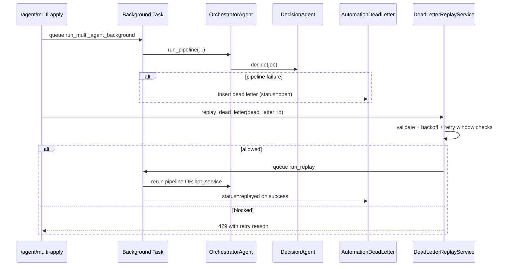

# 05 Automation Engine

## How to Use This Document

When asked to modify scrapers or automation logic, read this file to understand the current anti-bot bypass techniques and queue management. Do not propose synchronous scraping; always maintain the asynchronous, queue-based architecture documented here.

Instructions for future AI instances:

- Use this file before changing any scraper, orchestration, replay, or retry behavior.
- Preserve async entry points and queue-backed workflow semantics.
- Keep anti-bot settings (browser args, user-agent, pacing/rate limiting) unless there is a verified reason to change them.
- If refactoring scraper internals, keep compatibility with current service interfaces (`scrape_jobs(...)`, structured job dict output).

## Scope

Analyzed directories/modules:

- `bot_engine/`
- `backend/app/automation/`
- `backend/agents/decision_agent.py`
- `backend/agents/orchestrator_agent.py`
- Dead-letter/retry implementation in:
  - `backend/app/services/dead_letter_replay_service.py`
  - `backend/app/services/bot.py`
  - `backend/app/models/automation_dead_letter.py`
  - `backend/app/core/retry.py`

## Automation Architecture Overview

There are two interacting layers:

1. Backend automation runtime (`backend/app/automation` + `backend/app/services/job_scraper.py`)

- Uses Playwright async browser sessions.
- Emits WebSocket progress updates to authenticated users.
- Persists scraped jobs in MongoDB (`ScrapedJob`) with dedupe.
- Falls back to `bot_engine.scrapers.linkedin.scrape_jobs_from_linkedin` on specific Windows Playwright failures.

2. bot_engine runtime (`bot_engine`)

- Uses Selenium and thread-backed parallel scraping utilities.
- Uses queue-based resume generation worker pool.
- Provides async orchestration entry points (`BotEngine.process_jobs`, `scrape_and_apply`) over thread workers.

## `linkedin.py`, `indeed.py`, and `parallel_scraper.py` Architecture

## `bot_engine/scrapers/linkedin.py`

Function:

- `scrape_jobs_from_linkedin(keywords, location) -> List[Dict]`

Current behavior:

- Function-based scraper adapter.
- Returns mocked normalized job payloads (`title`, `company`, `location`, `description`, `link`, `source`).
- Simulated delay via `time.sleep(2)`.

Role in system:

- Used as fallback data source by backend scraper service under Windows-specific Playwright threading failure path.
- Not the primary production scraper implementation.

## `bot_engine/scrapers/indeed.py`

Function:

- `scrape_jobs_from_indeed(keywords, location) -> List[Dict]`

Current behavior:

- Function-based scraper adapter.
- Returns normalized mocked job payload.
- Simulated delay via `time.sleep(2)`.

Role in system:

- Extension point for platform-specific scraper logic.
- Maintains output schema compatibility with other scraper modules.

## `bot_engine/scrapers/parallel_scraper.py`

Classes:

- `RateLimiter`
- `ParallelScraper`

### `RateLimiter`

- Maintains in-memory request timestamps.
- Async lock-protected `acquire()` to serialize token-window checks.
- Enforces `max_requests` within `time_window`.
- Adds randomized delay (`1-3s`) to emulate human interaction pacing.

### `ParallelScraper`

- Uses `ThreadPoolExecutor(max_workers=...)` for concurrent Selenium tasks.
- `scrape_jobs(job_urls)` is async and orchestrates:
  1. async pacing via `RateLimiter.acquire()` per URL,
  2. submit blocking Selenium tasks (`_scrape_job`) into thread pool,
  3. collect futures with `as_completed` + timeout.
- `_scrape_job(job_url)` lifecycle:
  - create driver (`_create_driver`),
  - navigate and wait for page body,
  - extract fields via safe XPath helpers,
  - always cleanup driver.

Output contract:

- Each successful scrape returns dict with `url`, `title`, `company`, `description`, `location`.

Important architectural note:

- This module wraps blocking Selenium actions behind async orchestration and rate control.
- Maintain this async facade; do not convert callers back to purely synchronous scraping loops.

## Anti-Bot Bypass Techniques Currently Implemented

## Backend Playwright (`backend/app/automation/browser.py`)

`BrowserManager._launch_with_retry()` uses:

- Chromium args aimed at automation hardening and container compatibility:
  - `--disable-blink-features=AutomationControlled`
  - `--no-sandbox`
  - `--disable-setuid-sandbox`
  - `--disable-dev-shm-usage`
  - `--disable-accelerated-2d-canvas`
  - `--no-first-run`
  - `--no-zygote`
  - `--disable-gpu`
- Explicit realistic context profile:
  - desktop viewport
  - fixed Chrome-like user-agent
  - locale and timezone
- Init script to mask webdriver signal:
  - overrides `navigator.webdriver` getter to `undefined`

Resilience bypass:

- If Playwright executable is missing, performs runtime install (`python -m playwright install chromium`) and retries once.

## Backend LinkedIn scraper (`backend/app/automation/scrapers/linkedin.py`)

- URL query encoding via `quote_plus`.
- Multi-selector fallback strategy for changing DOM structures.
- Session cookie reuse (`SessionManager`) before guest-mode scrape.
- Mid-page scroll + delay for lazy-loaded cards.
- Relative URL normalization to absolute LinkedIn links.

## bot_engine anti-detection controls

In `bot_engine/automation/selenium_driver.py`:

- configurable headless mode,
- custom user-agent,
- no-sandbox and dev-shm flags,
- system binary preference for Chromium/ChromeDriver where available.

In `parallel_scraper.py`:

- request pacing and randomized delays via `RateLimiter`.

## Queue Management and Async Pipeline

## Resume queue (`bot_engine/queue/resume_queue.py`)

`ResumeGenerationQueue` architecture:

- Producer-consumer queue with worker threads (`num_workers=3` default).
- `start()` spins daemon workers.
- `submit(...)` enqueues task and marks status `pending`.
- Worker consumes task, computes resume, stores result in shared `results` map.
- `get_result(task_id, timeout)` asynchronously polls until `completed/failed`.
- `stop()` pushes sentinel `None` items and joins workers.

## Bot engine orchestrator (`bot_engine/engine.py`)

`BotEngine` architecture:

- Async semaphore for concurrent job application throttling.
- Queue-backed resume generation per job (`resume_queue.submit/get_result`).
- Async gather over `_process_single_job(...)` tasks for batch processing.
- `scrape_and_apply(...)` composes parallel scraping + queue-based application flow.

This is the canonical async + queue model for automation throughput.

## Decision Agent Operation (`backend/agents/decision_agent.py`)

Class: `DecisionAgent`.

Decision flow:

1. Rule layer (`_rule_based_evaluate`):

- Starts with base score 0.5.
- Applies memory-based boosts from `memory_service.get_successful_patterns`.
- Hard exclusion rule: seniority mismatch can force immediate skip.
- Computes skill keyword overlap score boost.

2. Early hard-skip return:

- If rule result is skip with high confidence (> 0.8), returns immediately.

3. AI layer (`decide` with `use_ai=True`):

- Calls `ai_service.evaluate_job_match(...)` for ambiguous cases.
- Sanitizes invalid AI decision labels to `skip` fallback.

Output contract:

- `{decision: apply|skip|maybe, confidence: float, reason: str}`

## Orchestrator Agent Operation (`backend/agents/orchestrator_agent.py`)

Class: `OrchestratorAgent` with helper agents:

- `ResumeAgent`
- `EmailAgent`

`run_pipeline(keyword, location, limit, ats_override=False)`:

1. Scrapes jobs via `job_scraper_service.scrape_jobs(...)`.
2. Builds rank list and scores candidates using decision-rule confidence.
3. Iterates top-N jobs and applies layered gates:

- `DecisionAgent.decide`
- policy gate via `automation_policy_service.evaluate`
- ATS gate via `ResumeAgent.assess_ats` with threshold `78`

4. Generates resume and sends application for passing jobs.
5. Persists audit trail to `AutomationEvent` via `_log_event`.
6. Persists/updates `JobApplication` status lifecycle.
7. Sends Telegram summary (if enabled).

Notes:

- Current job details are simulated from `jobs_found` count in this implementation; orchestration and gating logic remain real.

## Dead Letter Queues and Retries

## Dead-letter data model

`AutomationDeadLetter` (`automation_dead_letters` collection):

- `source`, `stage`, `task_name`
- `error_message`
- `payload`, `metadata`
- `retry_count`, `status` (`open|replayed|ignored`)
- indexed by source/stage/status/user/time for triage.

## Where dead letters are created

- `agent.py` background multi-apply wrapper writes dead letter on orchestrator failure.
- `bot.py` writes dead letters:
  - per-job processing failures (`stage='process_job'`)
  - top-level run failures (`stage='run_job_automation'`).

## Replay policy and execution (`dead_letter_replay_service.py`)

### Validation

`validate_payload(...)` normalizes and validates payload by `source`:

- `orchestrator_agent` expects `multi_apply` payload (`keyword`, `location`, `limit`, `ats_override`).
- `bot_service` expects `user_id`.

### Queue policy (`queue_replay`)

Controls:

- windowed replay attempts (`DEAD_LETTER_REPLAY_WINDOW_MINUTES`)
- max retries in active window (`DEAD_LETTER_REPLAY_MAX_RETRIES`)
- exponential backoff:
  - base `DEAD_LETTER_REPLAY_BACKOFF_BASE_SECONDS`
  - cap `DEAD_LETTER_REPLAY_BACKOFF_MAX_SECONDS`

Outcomes:

- updates dead-letter metadata (`last_replay_*`, attempts counters)
- increments `retry_count`
- writes replay audit events to `AutomationEvent`
- returns `(allowed, reason)` to endpoint

### Background replay (`run_replay`)

- Rehydrates dead letter by id.
- Dispatches to source-specific runner:
  - orchestrator: instantiate `OrchestratorAgent` and call `run_pipeline`
  - bot: call `bot_service.run_job_automation`
- On success:
  - set `status='replayed'`
  - update metadata and write success event
- On failure:
  - revert to `status='open'`
  - update error metadata and write error event

## Retry utilities (`backend/app/core/retry.py`)

Provided patterns:

- `retry_with_backoff(...)` for sync funcs
- `async_retry_with_backoff(...)` for async funcs
- `timeout(seconds)` decorator for async timeout boundaries
- `CircuitBreaker` class with states CLOSED/OPEN/HALF_OPEN

Applied in automation:

- `BotService.run_job_automation` -> `@timeout(3600)`
- `BotService._process_job_safe` -> `@timeout(600)`
- resume/email steps -> `@async_retry_with_backoff(max_retries=3, initial_delay=2, max_delay=30)`

## Operational Guidance for Future Changes

1. Maintain async entry points and queue-backed orchestration.
2. Keep anti-bot hardening flags and pacing controls by default.
3. Do not remove dead-letter writes in error paths.
4. Preserve replay policy protections (window + max retries + exponential backoff).
5. Ensure scraper outputs remain schema-compatible (`title/company/location/link/source`) to avoid downstream breakage.
6. If adding new scraper source, implement async orchestration path and include replay-safe payload shape.

## Sequence Diagram: Async Automation + Replay

