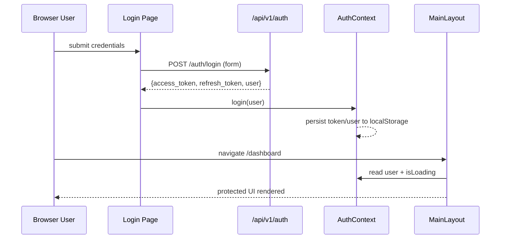
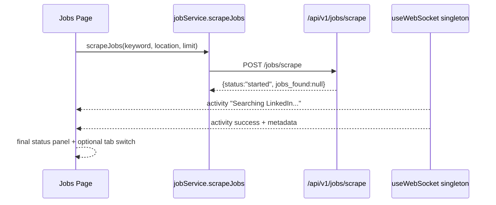

# 06 Frontend Architecture

## Application Entry and Provider Composition

Main entry point: `frontend/src/main.tsx`.

Provider composition order:

1. `QueryClientProvider` (`@tanstack/react-query`)
2. `ThemeProvider`
3. `FeatureProvider`
4. `BrowserRouter`
5. `AuthProvider`
6. `App`

React Query default options configured in `main.tsx`:

- query `staleTime`: 5 minutes
- query retry: 1

## Route Tree

Defined in `frontend/src/App.tsx` with lazy loaded route components.

Public routes:

- `/` -> `Landing`
- `/demo` -> `DemoDashboard`
- `/login` -> `Login`
- `/register` -> `Register`
- `/forgot-password` -> `ForgotPassword`
- `/reset-password` -> `ResetPassword`

Protected route shell:

- Layout route element: `MainLayout`
- child routes:
  - `/dashboard` -> `Dashboard`
  - `/jobs` -> `Jobs`
  - `/resumes` -> `Resumes`
  - `/profile` -> `Profile`
  - `/email-campaigns` -> `EmailCampaigns`
  - `/settings` -> `Settings`
  - `/admin` -> `Admin`

Fallback:

- `*` -> `NotFoundPage`

Global UI wrappers in `App`:

- `ErrorBoundary`
- `Toaster`
- `OfflineBanner`
- `Suspense` fallback loader

## Layout and Navigation Architecture

Main shell: `frontend/src/components/layout/MainLayout.tsx`.

Key responsibilities:

- auth guard (`if !user -> Navigate('/login')`)
- wraps app in `NotificationProvider`
- renders desktop `Sidebar` and animated mobile sidebar
- top bar with `CommandMenu`, `ThemeToggle`, `NotificationCenter`
- animated `<Outlet />` transitions

Sidebar config source:

- `sidebarNavigation` array in `frontend/src/components/layout/Sidebar.tsx`.
- Admin nav item is feature-flag gated (`isEnabled('admin_panel')`).

## State Management Strategy

The frontend uses a hybrid model:

1. Server state and caching: React Query.
2. App-wide state: React Context.
3. Request/transport state: Axios interceptors and service layer.
4. Live event state: shared WebSocket singleton.
5. Local component state: `useState`, `useEffect`, memoization hooks.

## Contexts

## AuthContext (`frontend/src/contexts/AuthContext.tsx`)

Exposes:

- `user`, `isAuthenticated`, `isLoading`
- `login(userData)`, `updateUser(userData)`, `logout()`

Behavior details:

- attempts token verification on mount (`authService.getCurrentUser`)
- 5 second verification timeout fallback to cached local user
- clears tokens only on actual 401 failure
- persists user object in `localStorage`

## FeatureContext (`frontend/src/contexts/FeatureContext.tsx`)

Tracks feature flags:

- `ai_resume`
- `ai_cover_letter`
- `email_automation`
- `job_scraping`
- `auto_apply`
- `admin_panel`

Behavior:

- fetch from `/features/` with 4 second timeout
- falls back to all-false defaults on timeout/unavailable backend
- exposes `isEnabled(feature)` helper

## ThemeContext (`frontend/src/contexts/user-theme.tsx`)

- supports `dark | light`
- default pref: dark if system dark, else light
- storage key: `vite-ui-theme`
- toggles root class on `document.documentElement`

## NotificationContext (`frontend/src/components/notifications/NotificationContext.tsx`)

- stores in-memory notification list
- computes unread count
- bridges websocket `notification` messages into toasts + notification list
- functions: `addNotification`, `markAsRead`, `markAllAsRead`, `clearAll`

## WebSocket Architecture

File: `frontend/src/hooks/useWebSocket.ts`.

Notable design:

- singleton `sharedWs` connection shared across all hook consumers
- subscriber set pattern (`Set<WebSocketSubscriber>`) for fan-out callbacks
- heartbeat ping every 30s
- reconnect logic with safeguards around close code 1005 and subscriber count
- message types: `notification | activity | status | error | ping | pong`

Activity normalization:

- incoming `activity` payload mapped to local `Activity` type
- metadata passthrough field `metadata?: Record<string, unknown>`

## Custom Hooks Inventory

From `frontend/src/hooks`:

- `useAuth` (service-oriented auth wrapper)
- `useJobs`
- `useResumes`
- `useWebSocket`
- `useApi`
- `useApiWithRetry`
- `useAsync`
- `useDebounce` (standalone file)
- `usePerformance.ts` exports utility hooks:
  - `useDebounce`
  - `useThrottle`
  - `useFilteredData`
  - `usePagination`
  - `useLocalStorage`
- `useLocalStorage` (separate generic implementation in `useLocalStorage.ts`)

Note: there are duplicate-named utilities across `usePerformance.ts` and dedicated hook files (`useDebounce`, `useLocalStorage`).

## Service Layer and API Client

## API client (`frontend/src/lib/api.ts`)

Two Axios clients:

- `apiClient` timeout 30s
- `apiClientLongTimeout` timeout 120s (used for scraping)

Request interceptors:

- attach `Authorization: Bearer <token>` from localStorage
- attach `X-CSRF-Token` from cookie if available
- remove `Content-Type` for FormData

Response interceptors:

- token refresh flow via `/auth/refresh`
- global toast for network/5xx errors (unless `_suppressGlobalErrorToast`)
- redirects to `/login` if refresh fails

## Service modules

- `auth.service.ts`
- `job.service.ts`
- `resume.service.ts`
- `user.service.ts`

Examples:

- job scraping client call: `jobService.scrapeJobs()` -> POST `/jobs/scrape` using long-timeout client.
- auth profile call: `authService.getCurrentUser()` -> GET `/auth/me`.

## UI Libraries and Component System

Primary UI stack:

- Tailwind CSS utility styling
- custom reusable UI components in `frontend/src/components/ui`
- iconography via `lucide-react`
- animation via `framer-motion`

Shared UI primitives include:

- `Button`, `Input`, `Card`, `Modal`, `Table`, `Badge`, `Tooltip`, `Skeleton`, `Loader`, `Toast`, `ThemeToggle`.

Page-level component groups:

- Dashboard components under `pages/Dashboard/components`
- Jobs components under `pages/Jobs/components`
- Resumes components under `pages/Resumes/components`
- Admin components under `pages/Admin/components`

## Data Flow Patterns

Common request path:

1. page component or hook calls service method.
2. service calls axios client (`apiClient` / `apiClientLongTimeout`).
3. response cached (React Query where used) or set in local state.
4. UI components render with loading/error empty states.

Live update path:

1. backend sends websocket JSON event.
2. singleton hook dispatches to subscribers.
3. feature/page contexts convert event into notifications/activity records.
4. UI updates without route reload.

## Sequence Diagram: Login and Protected Route Access



## Sequence Diagram: Job Scrape UX



## Concrete API Call Examples Used by UI

### Auth login (from `auth.service.ts`)

```http
POST /api/v1/auth/login
Content-Type: application/x-www-form-urlencoded

username=anura%40example.com&password=********
```

Expected response shape:

```json
{
  "access_token": "<jwt>",
  "refresh_token": "<jwt>",
  "token_type": "bearer",
  "user": {
    "id": "...",
    "email": "anura@example.com",
    "full_name": "Anurag Choudhary",
    "role": "user",
    "is_active": true,
    "username": "anura"
  }
}
```

### Trigger scrape (from `job.service.ts`)

```http
POST /api/v1/jobs/scrape?keyword=python&location=remote&limit=5
Authorization: Bearer <jwt>
```

Expected response shape:

```json
{
  "message": "Job scraping initialized in the background",
  "status": "started",
  "jobs_found": null
}
```
