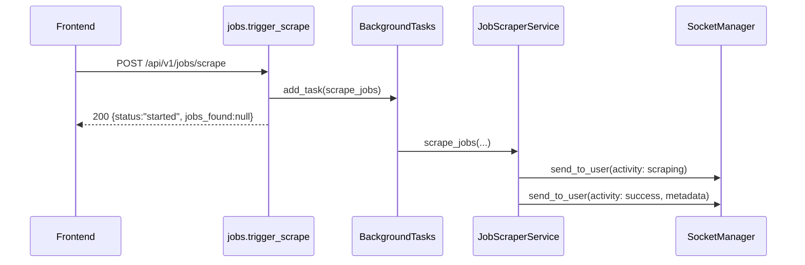

# 07 Backend API Routes

Routes are mounted under API prefix `/api/v1` via `backend/app/main.py` + `backend/app/api/api.py`.

## Router Mount Map

- `/agent` -> `backend/app/api/endpoints/agent.py`
- `/auth` -> `backend/app/api/endpoints/auth.py`
- `/scheduler` -> `backend/app/api/endpoints/scheduler.py`
- `/logs` -> `backend/app/api/endpoints/logs.py`
- `/stats` -> `backend/app/api/endpoints/stats.py`
- `/resumes` -> `backend/app/api/endpoints/resumes.py`
- `/jobs` -> `backend/app/api/endpoints/jobs.py`
- (no prefix) websocket router -> `backend/app/api/endpoints/websockets.py`
- `/ai` -> `backend/app/api/endpoints/ai.py`
- `/email` -> `backend/app/api/endpoints/email.py`
- `/emails` -> `backend/app/api/endpoints/emails.py`
- `/email-automation` -> `backend/app/api/endpoints/email_automation.py`
- `/telegram` -> `backend/app/api/endpoints/telegram.py`
- `/features` -> `backend/app/api/endpoints/features.py`
- (no prefix) users router -> `backend/app/api/endpoints/users.py`
- `/bot` -> `backend/app/api/endpoints/bot_runner.py`
- `/admin` -> `backend/app/api/endpoints/admin.py`

## Root and Health (outside `/api/v1`)

- `GET /` -> welcome payload.
- `HEAD /` -> probe response.
- `GET /health` -> environment + scheduler state.
- `GET /health/metrics` -> request metrics snapshot.

## Auth routes (`/api/v1/auth`)

- `POST /login` (`login`)
  - input: `OAuth2PasswordRequestForm` (`username`, `password`)
  - output: `Token` model; also sets `refresh_token` httpOnly cookie
- `POST /register` (`register`)
  - input: `UserCreate`
  - output: `RegisterResponse` (user + access/refresh token)
- `POST /refresh` (`refresh_token`)
  - input: `RefreshTokenRequest` or cookie
  - output: `Token`
- `GET /me` (`get_current_user_info`)
  - auth: current user
  - output: `UserSchema`
- `POST /change-password` (`change_password`)
  - input: `ChangePasswordRequest`
  - output: message JSON
- `POST /forgot-password` (`forgot_password`)
  - input: `ForgotPasswordRequest`
  - output: generic anti-enumeration message
- `POST /reset-password` (`reset_password`)
  - input: `ResetPasswordRequest`
  - output: message JSON

## User routes (no router prefix)

- `GET /api/v1/me` (`read_current_user`)
  - output: `UserSchema`
- `GET /api/v1/admin/users` (`read_users`)
  - query: `skip`, `limit`, `include_meta`
  - auth: admin
  - output: list or paginated `UserSchema`
- `GET /api/v1/admin/users/{user_id}` (`read_user_by_id`)
  - auth: admin
  - output: `UserSchema`

## Job routes (`/api/v1/jobs`)

- `GET|POST /scrape` (`trigger_scrape`)
  - query/body params: `keyword`, `location`, `limit`, optional `experience`, `job_type`
  - auth: active user
  - behavior: schedules background scraper, returns `{message,status,jobs_found}`
- `GET /scraped` (`list_scraped_jobs`)
  - query: `skip`, `limit`, `days`, `compact`, `include_meta`
  - auth: current user
  - output: scraped job list/paginated payload, ETag-enabled
- `GET /stats` (`get_stats`)
  - auth: current user
  - output: user job statistics
- `GET /jobs` path variant is `GET /api/v1/jobs` (`list_jobs`)
  - query: `skip`, `limit`, `status`, `search`, `sort`, `include_meta`
  - output: list or paginated `JobSchema`
- `GET /{job_id}` (`read_job`) -> `JobSchema`
- `POST /` (`create_job`) input `JobCreate` -> `JobCreateResponse`
- `PUT /{job_id}` (`update_job`) input `JobUpdate` -> `JobSchema`
- `DELETE /{job_id}` (`delete_job`) -> `{message: 'Job deleted'}`

## Resume routes (`/api/v1/resumes`)

- `POST /upload` (`upload_resume`)
  - multipart: `file`
  - auth: current user
  - output: `ResumeSchema`
- `POST /extract-text` (`extract_text`)
  - multipart: `file` (pdf/doc/docx)
  - output: extracted text string
- `POST /compile-latex` (`compile_latex`)
  - body: `{ latex: string }` (`embed=True`)
  - output: compiled PDF `FileResponse`
- `POST /save-generated` (`save_generated_resume`)
  - body: generated resume dict
  - output: `ResumeSchema`
- `GET /` (`list_resumes`)
  - query: `skip`, `limit`, `include_meta`
  - output: list or paginated resumes (ETag support)
- `GET /{resume_id}` (`get_resume`) -> `ResumeSchema`
- `GET /{resume_id}/download` (`download_resume`) -> file download
- `DELETE /{resume_id}` (`delete_resume`) -> message JSON
- `GET /job/{job_id}` (`get_resume_by_job`) -> `ResumeSchema`

## AI routes (`/api/v1/ai`)

- `POST /resume/generate` (`generate_resume_content`) input `ResumeGenerationRequest` -> `str`
- `POST /resume/generate-structured` (`generate_structured_resume`) input `ResumeGenerationRequest` -> `StructuredResume`
- `POST /resume/generate-latex` (`generate_latex_resume`) input `ResumeGenerationRequest` -> `str`
- `POST /resume/ats-score` (`score_latex_resume`) input `LatexAtsScoreRequest` -> scoring dict
- `POST /cover-letter/generate-structured` (`generate_structured_cover_letter`) input `CoverLetterRequest` -> `CoverLetter`
- `POST /resume/bullets` (`generate_resume_bullets`) input `ResumeBulletRequest` -> `str`
- `POST /cover-letter` (`generate_cover_letter`) input `CoverLetterRequest` -> `str`
- `POST /match` (`match_job_and_resume`) body fields `job_description`, `resume_text` -> matching workflow payload
- `POST /email` (`personalize_email`) input `EmailPersonalizationRequest` -> `str`

Most AI routes are feature-gated with `features.require(...)` and require authenticated user.

## Agent routes (`/api/v1/agent`)

- `POST /multi-apply` (`multi_apply`)
  - input: `MultiApplyRequest` (`keyword`, `location`, `limit`, `ats_override`)
  - action: schedules `run_multi_agent_background`
  - output: started message
- `POST /check-email` (`check_email`)
  - action: schedules inbox check task
- `GET /events` (`get_automation_events`)
  - query: `skip`, `limit`, optional `source`, `stage`, `action`
  - output: automation event rows
- `GET /dead-letters` (`get_dead_letters`)
  - query: `limit`, optional `status`, `source`
- `POST /dead-letters/{dead_letter_id}/status` (`update_dead_letter_status`)
  - input: `DeadLetterStatusRequest`
- `POST /dead-letters/{dead_letter_id}/replay` (`replay_dead_letter`)
  - action: queue replay job via dead-letter replay service

## Admin routes (`/api/v1/admin`)

- `GET /stats` (`get_admin_stats`) -> platform stats
- `GET /health` (`get_system_health`) -> component statuses
- `GET /users` (`list_all_users`) query `skip`,`limit`,`include_meta`,`search`
- `POST /users` (`create_user_admin`) input user dict (`email`,`name`,`role`)
- `PUT /users/{user_id}/status` (`toggle_user_status`) input `{is_active}`
- `DELETE /users/{user_id}` (`delete_user`)
- `GET /dead-letters` (`list_dead_letters_admin`) query `skip`,`limit`,`include_meta`,`search`,`status`,`source`
- `GET /dead-letters/metrics` (`get_dead_letter_metrics_admin`)
- `POST /dead-letters/{dead_letter_id}/status` (`update_dead_letter_status_admin`)
- `POST /dead-letters/{dead_letter_id}/replay` (`replay_dead_letter_admin`)

All require `deps.require_admin`.

## Email routes (`/api/v1/email`)

- `POST /send/hr` (`send_hr_email`)
  - multipart form fields:
    - `recipient_email`, `company_name`, `job_role`, `candidate_name`, `skills`, `portfolio_link`
    - file: `resume`
  - feature gate: `email_automation`
  - output: provider acceptance payload with `message_id` when available
- `POST /send/follow-up` (`send_follow_up_email`)
  - body: `FollowUpEmailRequest`
  - action: queue background send
- `GET /test` (`test_email_sending`)
  - sends test email with provider-level response details

## Email scraping routes (`/api/v1/emails`)

- `POST /scrape-hr` (`scrape_hr_emails`)
  - input: `ScrapeHREmailRequest` (`company`, optional `domain`)
  - output: `HREmailResponse`
  - behavior: returns cached result or pending with background scrape
- `GET /check-cached/{company}` (`check_cached_email`)
  - output: `{company,cached,email_count}`
- `POST /validate-email` (`validate_email`)
  - input: `email` param
  - output: `{email,valid}`

## Email automation route (`/api/v1/email-automation`)

- `POST /auto-send` (`auto_send_emails`)
  - input: `AutoSendEmailRequest`
  - action: starts background campaign in `email_automation_service`
  - output: started summary object

## Scheduler routes (`/api/v1/scheduler`)

- `GET /status` (`get_scheduler_status`) -> running flag + job list + timezone
- `POST /restart` (`restart_scheduler_endpoint`) -> restart scheduler
- `GET /jobs` (`list_jobs`) -> active scheduled jobs

## Logs routes (`/api/v1/logs`)

- `GET /` (`list_logs`)
  - query/pagination: `page`, `page_size`, optional `level`, `action`
  - output: `PaginatedResponse[LogSchema]`
  - cache decorator: `@cached(expire=30, key_prefix='logs_list')`
- `GET /{log_id}` (`get_log`) -> user-owned log
- `GET /log-test` (`test_logging`) -> logging pipeline smoke endpoint

## Stats route (`/api/v1/stats`)

- `GET /` (`get_stats`)
  - output: dashboard aggregate payload (includes `total_resumes` enrichment)

## Features route (`/api/v1/features`)

- `GET /` (`get_features`)
  - public endpoint
  - output: `FeatureFlagsResponse` flags for frontend gating

## Telegram route (`/api/v1/telegram`)

- `GET /test` (`test_telegram_alert`)
  - queues Telegram test alert background task

## Bot runner routes (`/api/v1/bot`)

- `POST /start` (`start_bot`)
  - starts user-scoped bot run in background
  - sends live websocket log/status updates
- `GET /status` (`get_bot_status`)
  - output: `{running: bool}`

## WebSocket route

- `WS /ws` (`websocket_endpoint`) in `websockets.py`
  - auth: JWT in query param `token`
  - behavior:
    - validates token,
    - registers connection by user id in `SocketManager`,
    - receives text and echoes user-scoped `event: message` envelopes.

## Sequence Diagram: `POST /jobs/scrape` End-to-End



## Concrete Request and Response Examples

### `POST /api/v1/auth/login`

Request:

```http
POST /api/v1/auth/login
Content-Type: application/x-www-form-urlencoded

username=anura%40example.com&password=********
```

Response:

```json
{
  "access_token": "<jwt>",
  "refresh_token": "<jwt>",
  "token_type": "bearer",
  "user": {
    "id": "6615d8bfa7c2b5d252d11111",
    "email": "anura@example.com",
    "username": "anura",
    "full_name": "Anurag Choudhary",
    "role": "user",
    "is_active": true
  }
}
```

### `POST /api/v1/jobs/scrape`

Request:

```http
POST /api/v1/jobs/scrape?keyword=python&location=remote&limit=5
Authorization: Bearer <jwt>
```

Immediate response:

```json
{
  "message": "Job scraping initialized in the background",
  "status": "started",
  "jobs_found": null
}
```

### `GET /api/v1/jobs/scraped?compact=true&include_meta=true`

Response:

```json
{
  "items": [
    {
      "id": "6615dfbfa7c2b5d252d55555",
      "title": "Senior Python Engineer",
      "company": "Tech Corp",
      "location": "Remote",
      "link": "https://www.linkedin.com/jobs/view/123456",
      "created_at": "2026-04-09T09:20:00.000Z"
    }
  ],
  "total": 1,
  "skip": 0,
  "limit": 100,
  "has_next": false,
  "has_prev": false
}
```

### WebSocket message received by frontend

```json
{
  "type": "activity",
  "data": {
    "activityType": "success",
    "title": "Job Scraper",
    "description": "Scraping complete! Found 10 jobs (3 new).",
    "metadata": {
      "total": 10,
      "new": 3
    }
  },
  "timestamp": "2026-04-09T12:34:56.000Z"
}
```
