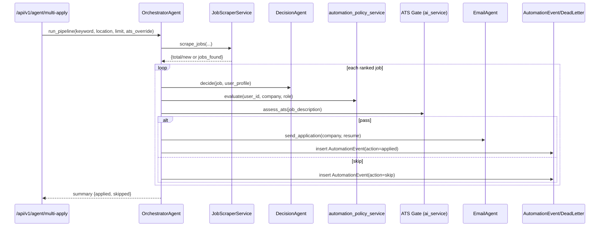

# 09 Bot Engine and Scrapers

## Scope Covered

This document covers:

- `bot_engine/` modules
- backend automation modules under `backend/app/automation`
- orchestration agents in `backend/agents/decision_agent.py` and `backend/agents/orchestrator_agent.py`

## Backend Automation Layer (`backend/app/automation`)

## Browser manager (`browser.py`)

Class: `BrowserManager`.

Key methods:

- `launch()` -> returns a Playwright `Page`.
- `_launch_with_retry(allow_install_retry)` -> internal retry logic.
- `close()` -> closes context/browser/playwright handles.

Launch behavior:

- starts Playwright async runtime,
- launches Chromium with anti-detection and container-safe args:
  - `--disable-blink-features=AutomationControlled`
  - `--no-sandbox`
  - `--disable-dev-shm-usage`
  - etc.
- creates browser context with explicit viewport, user-agent, locale, timezone.
- injects init script to mask `navigator.webdriver`.

Resilience:

- if launch error contains `Executable doesn't exist`, it runs runtime install:
  - `python -m playwright install chromium`
- then retries once.

## Session manager (`session.py`)

Class: `SessionManager`.

Responsibilities:

- `save_cookies(cookies)` to JSON file (`cookies.json` default).
- `load_cookies()` from local JSON file.

Used by scraper classes to attempt login/session reuse.

## Base scraper contract (`scrapers/base.py`)

Abstract class: `BaseScraper`.

Required methods:

- `login()`
- `scrape_jobs(keyword, location, limit)`

Shared helper:

- `save_session()` persists current Playwright context cookies through `SessionManager`.

## LinkedIn Playwright scraper (`scrapers/linkedin.py`)

Class: `LinkedInScraper(BaseScraper)`.

`login()` strategy:

- loads saved cookies,
- attempts to navigate to LinkedIn feed to verify resumed session,
- falls back to guest mode if no valid session.

`scrape_jobs(keyword, location, limit)` strategy:

- builds LinkedIn search URL using `quote_plus`.
- waits for one of several selectors to appear.
- scrolls for lazy loading.
- attempts card discovery through ordered selector fallbacks:
  1. `li:has(a[href*='/jobs/view/'])`
  2. `li.jobs-search-results__list-item`
  3. `div.job-card-container`
  4. `div.base-card`
- extracts title/company/location/link with multiple selector fallbacks.
- normalizes relative links to absolute LinkedIn links.
- returns list with fields:
  - `title`, `company`, `location`, `link`, `source='linkedin'`.

## Backend scraping service orchestration (`backend/app/services/job_scraper.py`)

Class: `JobScraperService`.

Main method:

- `scrape_jobs(keyword, location, limit, user_id=None)`.

Flow:

1. feature gate check (`JOB_SCRAPING_ENABLED`).
2. emits websocket progress events through `SocketManager.send_to_user` (activity title `Job Scraper`).
3. launches browser and linkedIn scraper.
4. saves only new rows into `ScrapedJob`; dedupe by `link`.
5. updates existing rows `created_at` for recurring jobs.
6. clears `jobs:scraped:*` cache pattern.
7. emits completion metadata (`total`, `new`) in websocket payload.
8. sends Telegram alerts for newly discovered jobs and failures.

Windows fallback path:

- on Playwright `NotImplementedError`, imports `bot_engine.scrapers.linkedin.scrape_jobs_from_linkedin` and continues insertion logic.

## bot_engine Structure

## Orchestration engine (`bot_engine/engine.py`)

Class: `BotEngine`.

Init:

- creates semaphore for max concurrent jobs.
- starts global `resume_queue` workers.
- creates thread pool (`ThreadPoolExecutor`).

Primary methods:

- `process_jobs(jobs, user_profile)`
  - concurrent job processing via `asyncio.gather`
  - aggregates success/failure/errors and throughput metric (`jobs_per_hour`)
- `_process_single_job(job, user_profile)`
  - submits resume generation task to queue
  - waits for queue result
  - sends application email (placeholder `_send_application_email`)
- `scrape_and_apply(job_urls, user_profile)`
  - uses `parallel_scraper.scraper.scrape_jobs`
  - pipes results into `process_jobs`
- `shutdown()`
  - stops queue, scraper, executor.

## Selenium driver (`bot_engine/automation/selenium_driver.py`)

Function: `get_selenium_driver(headless=True)`.

Behavior:

- sets Chrome options (`--headless`, `--no-sandbox`, `--disable-dev-shm-usage`, custom user-agent).
- prefers system binaries (`/usr/bin/chromium`, `/usr/bin/chromedriver`) if present.
- falls back to webdriver-manager installation if chromedriver not found.

## Auto-apply helper (`bot_engine/automation/apply.py`)

Functions:

- `auto_apply_selenium(job_url, resume_path, user_data)`
  - opens job URL with visible browser (`headless=False`), placeholder form-fill hooks.
- `chrome_extension_support(data)`
  - placeholder extension data sync hook.

## Scrapers in bot_engine (`bot_engine/scrapers`)

Current state in code:

- `linkedin.py`, `indeed.py`, `naukri.py` expose function-based scrapers returning mock job data with required fields.
- these are lightweight placeholders, not full DOM automation modules.

Functions:

- `scrape_jobs_from_linkedin(keywords, location)`
- `scrape_jobs_from_indeed(keywords, location)`
- `scrape_jobs_from_naukri(keywords, location)`

## Parallel scraper (`bot_engine/scrapers/parallel_scraper.py`)

Classes:

- `RateLimiter`
  - request budget per time window with async lock.
  - introduces random delay to mimic human behavior.
- `ParallelScraper`
  - thread pool-backed concurrent scraping.
  - `_create_driver()`, `_scrape_job()`, `_safe_extract()`, `scrape_jobs()`, `shutdown()`.

Global singleton:

- `scraper = ParallelScraper(max_workers=5, rate_limit=10)`.

Implementation note:

- `_create_driver()` imports `get_selenium_driver` from `automation.selenium_driver` (module path expected at runtime).

## Resume queue (`bot_engine/queue/resume_queue.py`)

Class: `ResumeGenerationQueue`.

Mechanics:

- in-memory `Queue` for tasks.
- worker thread pool (`num_workers=3` default).
- task result dict keyed by task id.

Key methods:

- `start()`, `stop()`
- `submit(task_id, job_description, user_profile)`
- `get_result(task_id, timeout=60)`
- `_generate_resume(...)` placeholder generator

Global instance:

- `resume_queue = ResumeGenerationQueue(num_workers=3)`.

## AI Decision and Orchestration Agents

## Decision agent (`backend/agents/decision_agent.py`)

Class: `DecisionAgent`.

Core methods:

- `_rule_based_evaluate(job, user_profile, successful_patterns=None)`
- `decide(job, user_profile='', user_id='')`

Behavior:

- computes heuristic score from profile/job text overlap.
- pattern boost from `memory_service.get_successful_patterns(user_id)`.
- hard skip rule for obvious seniority mismatch (`senior` title vs `junior` profile).
- threshold defaults:
  - apply when score >= 0.6
  - maybe when score >= 0.4
- optional AI escalation via `ai_service.evaluate_job_match` for non-hard-skip scenarios.
- safeguards AI output to one of `apply|skip|maybe`.

## Orchestrator agent (`backend/agents/orchestrator_agent.py`)

Classes:

- `ResumeAgent`
- `EmailAgent`
- `OrchestratorAgent`

`OrchestratorAgent` flow (`run_pipeline`):

1. scrape via `job_scraper_service.scrape_jobs`.
2. construct rankable job candidates (currently simulated objects based on scraped count).
3. rank by `DecisionAgent._rule_based_evaluate` confidence.
4. persist/lookup `JobApplication` records.
5. enforce policy gate (`automation_policy_service.evaluate`).
6. enforce ATS gate (`ResumeAgent.assess_ats`, threshold `ats_auto_apply_min_score=78`) with optional `ats_override`.
7. generate resume (`ResumeAgent.generate`).
8. send application (`EmailAgent.send_application` placeholder).
9. log audit events to `AutomationEvent` with `_log_event`.
10. send Telegram summary when enabled.

## How the pieces fit together

- Production API-triggered scraping and automation primarily run through backend services and agents.
- `bot_engine` provides reusable selenium/parallel/queue modules and a fallback LinkedIn scraper path used by backend on Windows-threading errors.
- Persistent auditability is implemented in backend (`AutomationEvent`, `AutomationDeadLetter`, `JobApplication`) rather than inside bot_engine internals.

## Sequence Diagram: Multi-Agent Apply Pipeline



## Sequence Diagram: Backend Scrape with Playwright + Fallback

```mermaid
sequenceDiagram
    participant S as JobScraperService
    participant B as BrowserManager
    participant L as LinkedInScraper
    participant M as Mongo ScrapedJob
    participant T as Telegram
    participant F as bot_engine fallback

    S->>B: launch()
    alt Playwright available
        B-->>S: page
        S->>L: login(); scrape_jobs()
        L-->>S: jobs[]
    else Windows NotImplementedError
        S->>F: scrape_jobs_from_linkedin()
        F-->>S: jobs[]
    end
    S->>M: insert non-duplicate links
    S->>T: send alert for new jobs/failures
```

## Concrete Data Examples Used in Pipeline

### Decision output

```json
{
  "decision": "apply",
  "confidence": 0.72,
  "reason": "Rule Match: Found 4 keyword skill overlaps."
}
```

### Automation event row

```json
{
  "user_id": "6615d8bfa7c2b5d252d11111",
  "source": "orchestrator_agent",
  "stage": "ats_gate",
  "company": "Tech Corp",
  "role": "Python Engineer",
  "action": "skip",
  "reason": "ATS gate failed",
  "ats_score": 63,
  "passes_gate": false,
  "override_used": false,
  "metadata": {
    "threshold": 78
  }
}
```

### Dead letter row

```json
{
  "user_id": "6615d8bfa7c2b5d252d11111",
  "source": "bot_service",
  "stage": "process_job",
  "task_name": "process_job",
  "error_message": "SMTP timeout",
  "payload": {
    "job_id": "6615d9bfa7c2b5d252d22222",
    "company": "Tech Corp",
    "role": "Python Engineer"
  },
  "retry_count": 0,
  "status": "open"
}
```
