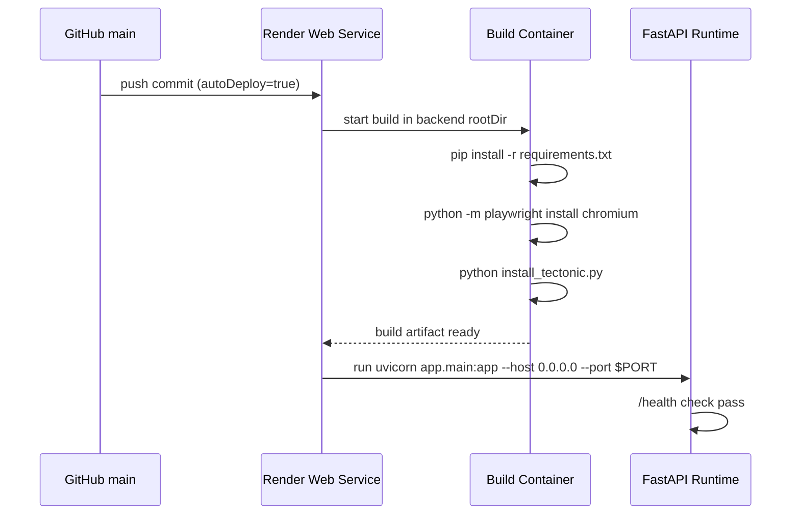
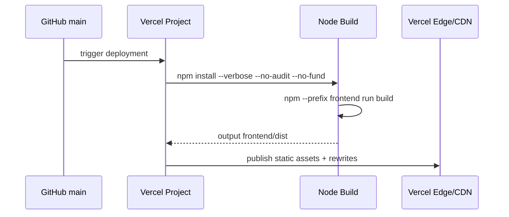

# 11 DevOps and Deployment

## Deployment Targets in Repository

## Backend deployment (Render)

File: `render.yaml`.

Service config:

- `type: web`
- `name: ai-job-automation-backend`
- `runtime: python`
- `rootDir: backend`
- `plan: starter`
- `autoDeploy: true`

Build/start:

- build command:
  - `pip install --upgrade pip`
  - `pip install -r requirements.txt`
  - `python -m playwright install chromium`
  - `python install_tectonic.py`
- start command:
  - `uvicorn app.main:app --host 0.0.0.0 --port $PORT`
- health check path: `/health`

Key env vars declared in Render blueprint:

- `DEBUG=false`
- `ENVIRONMENT=production`
- `SECRET_KEY` generated
- `CSRF_SECRET_KEY` generated
- `MONGODB_URI` (sync false)
- `MONGODB_DB_NAME=job_automation`
- `REDIS_URL` (sync false)
- `BACKEND_CORS_ORIGINS` (sync false)
- `ALLOWED_HOSTS` (sync false)
- `OPENAI_API_KEY` / `GROQ_API_KEY` (sync false)
- `EMAIL_ENABLED=true`
- `PLAYWRIGHT_BROWSERS_PATH=/opt/render/project/src/.playwright`
- `EMAIL_DEV_MODE=false`
- `RESEND_API_KEY`, `RESEND_FROM_EMAIL` (sync false)

Operational implication:

- Playwright browser binary installation is explicitly part of build and runtime path is pinned.

## Frontend deployment (Vercel)

Two Vercel configs exist:

## Root `vercel.json`

- install command: `npm install --verbose --no-audit --no-fund`
- build command: `npm --prefix frontend run build`
- output directory: `frontend/dist`
- rewrite all paths to `/index.html` (SPA routing)
- security headers and long-lived immutable asset caching for `/assets/*`

## `frontend/vercel.json`

- install command: same as above
- build command: `npm run build`
- output directory: `dist`
- same SPA rewrite and security headers

Both encode the same hosting model; root config supports monorepo-style Vercel build from repository root.

## Build/Test/Review Automation Scripts

## Root scripts (`scripts/`)

### `scripts/test-all.ps1`

Runs full backend + frontend coverage scripts and enforces successful exit for both.

Flow:

1. run `backend/scripts/test-coverage.ps1`
2. run `frontend/scripts/test-coverage.ps1`
3. fail overall if either side fails

### `scripts/pre-pr-review.ps1`

Pre-PR pipeline:

1. optionally run test suite (`test-all.ps1`) unless `-SkipTests`
2. run code-review-graph checks via `scripts/crg-review.ps1`

### `scripts/crg-review.ps1`

Code Review Graph integration script:

- resolves local/global `code-review-graph` binary
- supports incremental update (`update --base`) or full rebuild (`build`)
- runs `detect-changes` report after graph update

## Backend coverage script

`backend/scripts/test-coverage.ps1`:

- runs pytest with:
  - `--cov=app`
  - terminal/html/xml reports
  - `--cov-fail-under=80`

## Frontend coverage script

`frontend/scripts/test-coverage.ps1`:

- runs `npm run test:coverage`
- expected to enforce configured coverage thresholds in frontend test tooling.

## CI/GitHub Actions status

No `.github/workflows/*.yml` files were found in the current workspace scan.

Implication:

- automated CI appears script-driven and local/agent-triggered, not GitHub Actions workflow-driven in this repo snapshot.

## Runtime Configuration Surfaces

## Backend settings (`backend/app/core/config.py`)

Important deployment-facing settings:

- `API_V1_STR=/api/v1`
- DB/redis URLs
- feature flags (`FEATURE_*` and `JOB_SCRAPING_ENABLED`)
- scheduler controls (`SCHEDULER_ENABLED`, timezone)
- rate limit toggles
- CSRF toggle
- environment mode via `DEBUG` and `ENVIRONMENT`

## Security posture in deployed runtime

From `backend/app/main.py` and Vercel headers:

- response headers include frame/content/referrer policy constraints.
- optional `TrustedHostMiddleware` in production.
- CORS allowlist sourced from env.
- CSRF middleware enabled only when production + env flag.

## Dev environments and package boundaries

- root `package.json` orchestrates frontend scripts from monorepo root.
- backend dependency management via `backend/requirements.txt`.
- bot_engine has its own `bot_engine/requirements.txt`.

This split enables independent service deploy/runtime behavior while sharing one repository.

## Sequence Diagram: Backend Deployment on Render



## Sequence Diagram: Frontend Deployment on Vercel



## Operational Examples

### Run full local quality gate

```powershell
.\scripts\pre-pr-review.ps1 -Base origin/main
```

### Run full coverage only

```powershell
.\scripts\test-all.ps1
```

### Render API health probe response shape

```json
{
  "status": "healthy",
  "environment": "production",
  "version": "1.0.0",
  "scheduler": {
    "running": true,
    "jobs": 4
  }
}
```
